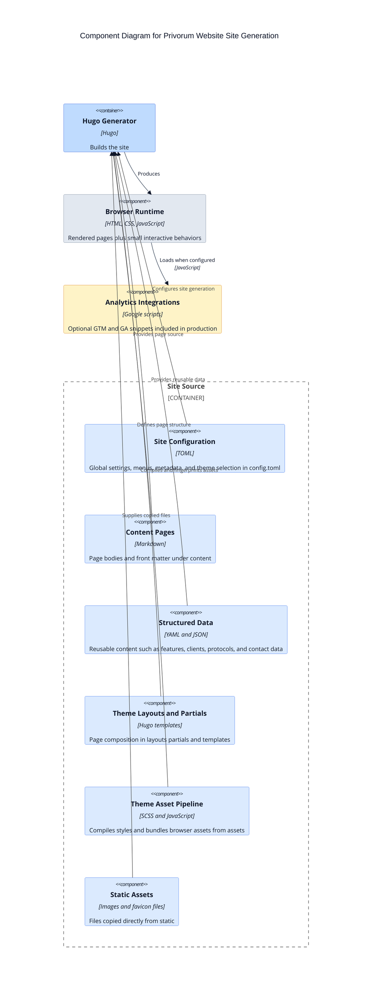

# C4 Component Diagram

This component view focuses on the internal structure that matters most in this repository: how Hugo assembles the website from content, data, templates, and assets.

## Component notes

- `layouts/_default/baseof.html` is the main composition root for shared page structure.
- `layouts/index.html`, `layouts/services/*`, `layouts/team/*`, and similar templates provide page-type-specific rendering.
- `assets/js/scripts.js` provides the primary interactive behavior in this repository: toggling the mobile menu state.
- `assets/js/pages/services.js` and `assets/js/libs/library.js` are currently placeholders with console logging rather than substantial application logic.
