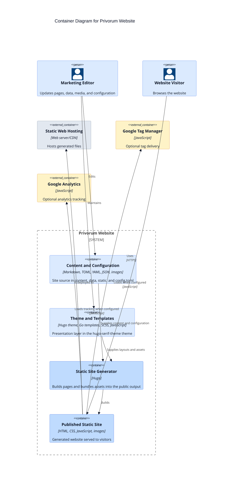

# C4 Container Diagram

This project is not a multi-service application. The most useful container view is the separation between source inputs, Hugo generation, published static assets, and the browser runtime.

## Container responsibilities

- `Content and Configuration` defines the site structure, page copy, metadata, menus, and reusable data sets.
- `Theme and Templates` defines shared layouts, SCSS compilation inputs, partials, and browser-side behavior like the mobile menu toggle.
- `Static Site Generator` resolves content against layouts and produces deployable files.
- `Published Static Site` is the only runtime artifact exposed to end users.
