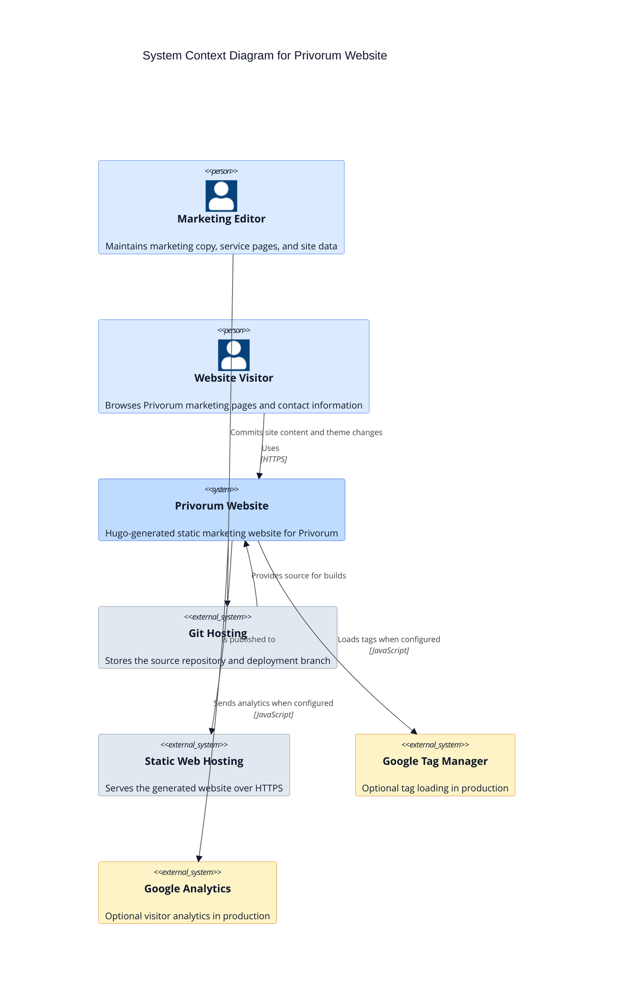

# C4 System Context

This diagram shows the Privorum website as a single software system and the external actors and services around it.

## Notes

- The system has no application backend in this repository.
- Contact information is rendered statically from repository data, not submitted to a server-side form handler.
- Google integrations are optional and controlled by Hugo params or environment variables.
