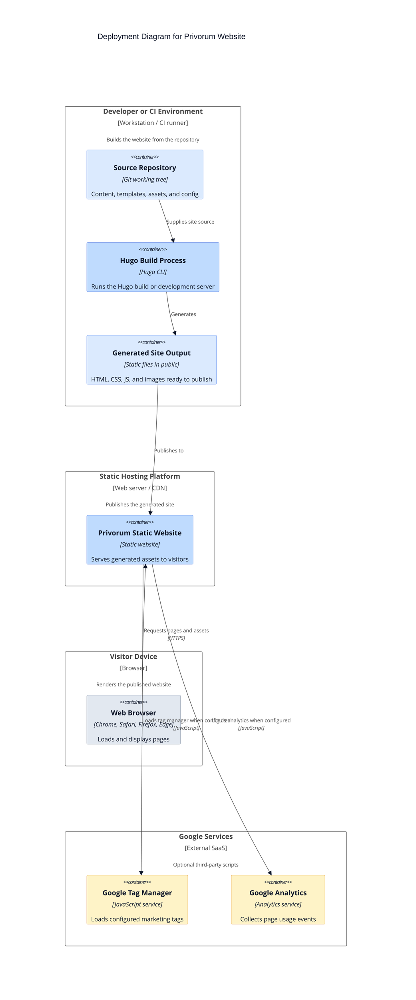

# C4 Deployment Diagram

This deployment view reflects the deployment approach visible in the repository: Hugo generates static files locally or in CI, and those files are published to static hosting.

## Deployment notes

- The `Makefile` supports local development with `./hugo server --watch=true`.
- The `build` target removes `public/` and regenerates the site with `./hugo`.
- `deploy.sh` indicates a Git-based publication flow using the generated `public/` directory and pushing to a publish branch.
- No server-side compute, database, or queue is defined in this repository.
